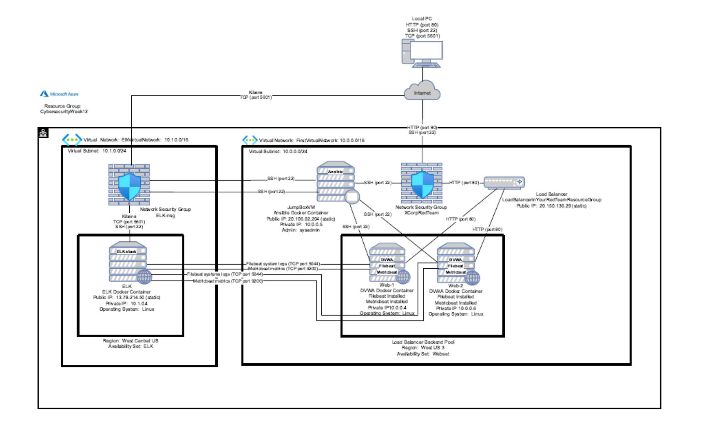
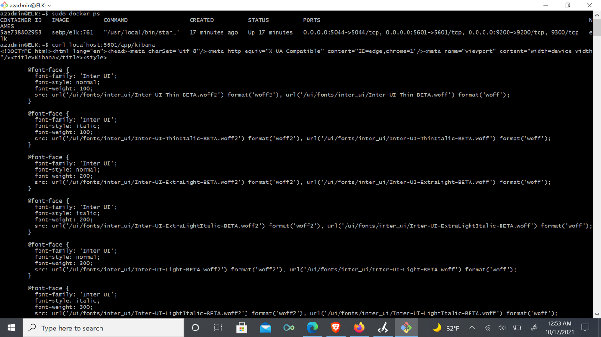

## Automated ELK Stack Deployment

The files in this repository were used to configure the network depicted below.

These files have been tested and used to generate a live ELK deployment on Azure. They can be used to either recreate the entire deployment pictured above. Alternatively, select portions of the _____ file may be used to install only certain pieces of it, such as Filebeat.

  • ELK install playbook (install-elk.yml)
  • Metricbeat configuration (metricbeat-config.yml)
  • Metricbeat playbook (metricbeat-playbook.yml)
  • Filebeat configuration (filebeat-config.yml)
  • Filebeat playbook (filebeat-playbook.yml)

This document contains the following details:
- Description of the Topology
- Access Policies
- ELK Configuration
  - Beats in Use
  - Machines Being Monitored
- How to Use the Ansible Build

### Description of the Topology

The main purpose of this network is to expose a load-balanced and monitored instance of DVWA, the D*mn Vulnerable Web Application.

Load balancing ensures that the application will be highly available, in addition to restricting access to the network.
- _What aspect of security do load balancers protect?_ 
  A load balancer sits between a client and multiple servers, intelligently distributing network traffic to provide additional security 
  (defending against DDoS attacks by shifting attack traffic), availability, performance, resilience, and simplicity for handling 
  website traffic.  
  
- _What is the advantage of a jump box?_
  A jump box is a secure server that is used to originate connections to other servers from untrusted environments and therefore 
  provides security via access control, giving access to a user from only a single secured and monitored node.  A jump box also 
  supports automation and network segementation.  The jump box provides a segregation layer for the network and only allows specific
  machines to connect to the jumpbox which therefore reduces the attack surface area.

Integrating an ELK server allows users to easily monitor the vulnerable VMs for changes to the the data and system logs.
- _What does Filebeat watch for?_
  Filebeat watches for (monitors and logs) changes in system (such as SSH logins, system logs, and sudo commands), including both the
  nature of the change and when that change occurred, and then forwards the corresponding event log files either to Elasticsearch or 
  Logstash for indexing.
  
- _What does Metricbeat record?_
  Metricbeat records metrics and statistics from the system and the various services running on a server and then forwards the metircs 
  either to Elasticsearch or Logstash for indexing.
  

The configuration details of each machine may be found below.

| Name         | Function      | Internal IP Address | External IP Address | IP Address Type | Operating System | Service                       |
|--------------|---------------|---------------------|---------------------|-----------------|------------------|-------------------------------|
| JumpBoxVM    | Gateway       | 10.0.0.5            | 20.106.92.204       | static          | Linux (Ubuntu)   | Jump Box                      |
| Web-1        | Web Server    | 10.0.0.4            | -                   | -               | Linux (Ubuntu)   | DVWA                          |
| Web-2        | Web Server    | 10.0.0.6            | -                   | -               | Linux (Ubuntu)   | DVWA                          |
| ELK          | Web Server    | 10.1.0.4            | 13.78.214.50        | static          | Linux (Ubuntu)   | ELK log and metric monitoring |
| LoadBalancer | Load Balancer | -                   | 20.150.136.29       | static          | -                | Load Balancer                 |

### Access Policies

The machines on the internal network are not exposed to the public Internet. 

Only the Jumpbox machine can accept connections from the Internet. Access to this machine is only allowed from the following IP addresses:
- _Add whitelisted IP addresses_
  The public IP address of my computer (presently 174.81.10.184)

Machines within the network can only be accessed by the Jumpbox.
- _Which machine did you allow to access your ELK VM?_
  My computer 
  _What was its IP address?_
  presently 174.81.10.184

A summary of the access policies in place can be found in the table below.

| Name         | Publicly Accessible | Allowed IP Addresses |
|--------------|---------------------|----------------------|
| JumpBoxVM    | Yes                 | My computer IP       |
| Web-1        | No                  | 10.0.0.5             |
| Web-2        | No                  | 10.0.0.5             |
| ELK          | Yes                 | My computer IP       |
| LoadBalancer | Yes                 | Open                 |

### Elk Configuration

Ansible was used to automate configuration of the ELK machine. No configuration was performed manually, which is advantageous because...
- _What is the main advantage of automating configuration with Ansible?_
  A playbook can be used to configure multiple machines at the same time with the exact same configuration. 
  Uses human readable commands that are run in the order that they are written.
  Corrections need only be made once for a multi-machine deployment.
  Can model even highly complex IT workflows.
  Does not require a separate manegement system, additional software, or more firewall ports on the client systems.
  

The playbook implements the following tasks:
- _In 3-5 bullets, explain the steps of the ELK installation play. E.g., install Docker; download image; etc._
  - Set virtual memory to 262144
  - Install Docker.io into system
  - Install Python3Pip package manager
  - Install Python client for docker
  - Download the Elk Docker container
  - Configure the initial port settings for the Elk Docker container
  - Start the Elk Docker container
  - Enable the Elk Docker on boot
  

The following screenshot displays the result of running `docker ps` after successfully configuring the ELK instance.

### Target Machines & Beats
This ELK server is configured to monitor the following machines:
- _List the IP addresses of the machines you are monitoring_
  Web-1: 10.0.0.4
  Web-2: 10.0.0.6

We have installed the following Beats on these machines:
- _Specify which Beats you successfully installed_
  Filebeat
  Metricbeat

These Beats allow us to collect the following information from each machine:
- _In 1-2 sentences, explain what kind of data each beat collects, and provide 1 example of what you expect to see. E.g., `Winlogbeat` collects Windows logs, which we use to track user logon events, etc._
  - Filebeat : Monitors log files for changes to the system, such as configuration modifications or kill commands
  - Metricbeat : Monitors system metrics like CPU usage, Ram etc. which indicate resource consumption
  

### Using the Playbook
In order to use the playbook, you will need to have an Ansible control node already configured. Assuming you have such a control node provisioned: 

SSH into the control node and follow the steps below: (Note:  X can be either file or metric)
- Copy the /etc/ansible/files/Xbeat-config.yml file in the Ansible container on the JumpBoxVM to /etc/Xbeat/Xbeat.yml on each of the two web servers.
- Update the /etc/ansible/roles/Xbeat-playbook.yml file in the Ansible container on the JumpBoxVM to include the group of machines on which to run the playbook.
- Run the playbook, and navigate to <public_ip_of_elk_machine>:5601/app/kibana#/home to check that the installation worked as expected.

_Answer the following questions to fill in the blanks:_
- _Which file is the playbook?_ 
  /etc/ansible/files/Xbeat-config.yml in the Ansible container on the JumpBoxVM
- _Where do you copy it?_
  /etc/Xbeat/Xbeat.yml on each of the two web servers  
- _Which file do you update to make Ansible run the playbook on a specific machine?_
  /etc/ansible/roles/Xbeat-playbook.yml in the Ansible container on the JumpBoxVM
- _How do I specify which machine to install the ELK server on versus which to install Filebeat on?_
  "hosts" in /etc/ansible/install-elk.yml in the Ansible container on the JumpBoxVM indicates that ELK installs on the ELK server
  "hosts" in /etc/ansible/roles/Xbeat-playbook.yml in the Ansible container on the JumpBoxVM indicates that Xbeat installs on the two webservers
- _Which URL do you navigate to in order to check that the ELK server is running?_
  <public_ip_of_elk_machine>:5601/app/kibana#/home (in this case, 13.78.214.50:5601/app/kibana#/home)

_As a **Bonus**, provide the specific commands the user will need to run to download the playbook, update the files, etc._
  sudo docker start [container name]
  sudo docker ps
  sudo docker exec -ti [container name] bash
  sudo ansible-playbook [.yml file to run] 
  